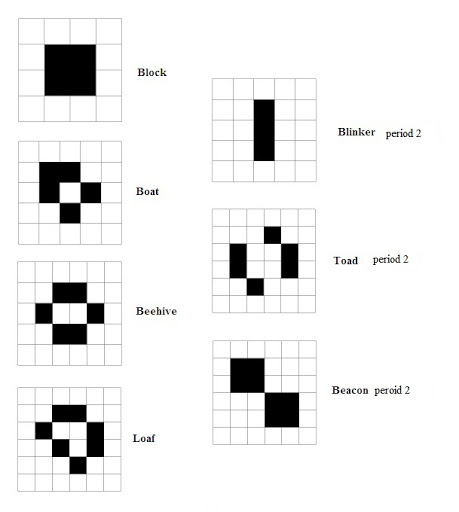

# The Game of Life (John H. Conway, 1970)

The "Game of Life" developed by the English mathematician John Horton Conway is a cellular automaton. Cellular automata are discrete models that
 consist of a regular grid in which each cell has a defined state. The simulation proceeds in discrete time steps. The new state of a cell only
  depends on the state of the neighboring cells in the previous time step. The simulation can create complex patterns using simple rules.

The “game” is a zero-player game, meaning that its evolution is determined by its initial state, requiring no further input. One interacts with the
 Game of Life by creating an initial configuration and observing how it evolves, or, for advanced “players”, by creating patterns with particular
  properties.
  
## Rules of Conway Game of Life:

##### Rule 1:
* An alive cell dies in the next generation if it is surrounded by less than two alive neighbor cells, as if it were caused by under-population.
* Any live cell with fewer than two live neighbours dies, as if by underpopulation.

##### Rule 2:
* An alive cell can survive in the next generation if it is sur-rounded by two or three alive neighbor cells.
* Any live cell with two or three live neighbours lives on to the next generation.

##### Rule 3: 
An alive cell dies in the next generation if it is surrounded by more than three alive neighbor cells, as if it were caused by over-population.
Any live cell with more than three live neighbours dies, as if by overpopulation.

##### Rule 4:
* A dead cell can revive if it is surrounded by exactly three alive neighbor cells, as if it were a reproduction
* Any dead cell with exactly three live neighbours becomes a live cell, as if by reproduction.

The following link will provide additional information on rules ["here"](https://youtu.be/hY4M-W_OZ5s)

## Interesting shapes

Some interesting shape in the game of life are like the ones in the following diagrams:

1. Common shapes

2. Some shapes life cycle

The following video cantains some epic:
["Video of epic games"](https://youtu.be/C2vgICfQawE)

